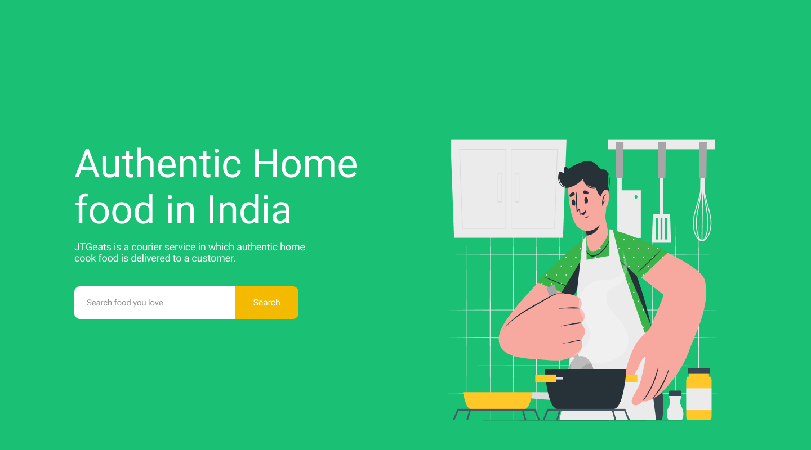
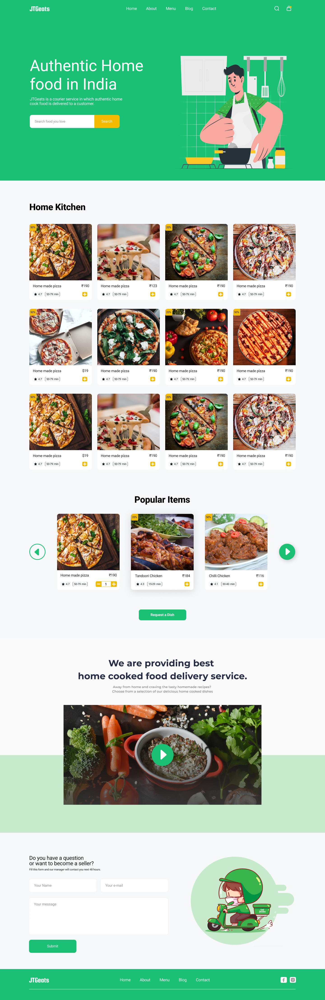

# 🍲 Authentic Home Food - Home Page UI

A simple and modern frontend homepage built using HTML, CSS, and JavaScript, designed for showcasing traditional and homemade food in a clean, user-friendly interface.

# 🌐 Project Overview

Authentic Home Food is a static homepage that highlights:

A welcoming hero section with imagery and slogan

A brief "About Us" section describing your authenticity

A featured dishes or menu section

Clean navigation and responsive layout

Modern color scheme and smooth scrolling

This project is ideal as a starting point for food businesses looking to create an online presence with a minimal and elegant look.

# 🔧 Tech Stack

HTML5 – Semantic structure

CSS3 – Styling and responsive layout (Flexbox, Grid)

JavaScript – Simple interactivity (scroll, toggles, navigation highlights)

# 🌟 Features

Responsive layout (mobile-friendly)

Clean UI with modern fonts

Easy to customize for any food brand

Lightweight with no dependencies

